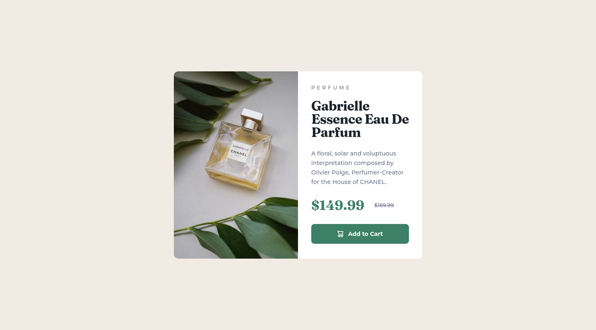

# Frontend Mentor - Product preview card component solution

This is a solution to the [Product preview card component challenge on Frontend Mentor](https://www.frontendmentor.io/challenges/product-preview-card-component-GO7UmttRfa). Frontend Mentor challenges help you improve your coding skills by building realistic projects. 

## Table of contents

- [Overview](#overview)
  - [The challenge](#the-challenge)
  - [Screenshot](#screenshot)
  - [Links](#links)
- [My process](#my-process)
  - [Built with](#built-with)
  - [What I learned](#what-i-learned)
  - [Continued development](#continued-development)
  - [Useful resources](#useful-resources)
- [Author](#author)

## Overview

### The challenge

Users should be able to:

- View the optimal layout depending on their device's screen size
- See hover and focus states for interactive elements

### Screenshot

### Links

- Solution URL: [GitHub](https://github.com/GrzywN/product-preview-card-component-main)
- Live Site URL: [Netlify](https://fastidious-panda-80b3ed.netlify.app/)

## My process

### Built with

- Semantic HTML5 markup
- CSS custom properties
- Flexbox / CSS Grid
- Mobile-first workflow
- Vanilla Javascript
- Web components (Custom HTMLElement, Shadow DOM)

### What I learned

I learned how to build and use modern web components. They're great because it's easy to use them with all modern frameworks.

### Continued development

I might improve this solution in the future based on feedback.

### Useful resources

- [JavaScript - The Complete Guide 2022 (Beginner + Advanced)](https://www.udemy.com/course/javascript-the-complete-guide-2020-beginner-advanced/)

## Author

- Frontend Mentor - [@GrzywN](https://www.frontendmentor.io/profile/GrzywN)
- Twitter - [@GrzywN](https://www.twitter.com/GrzywN)
